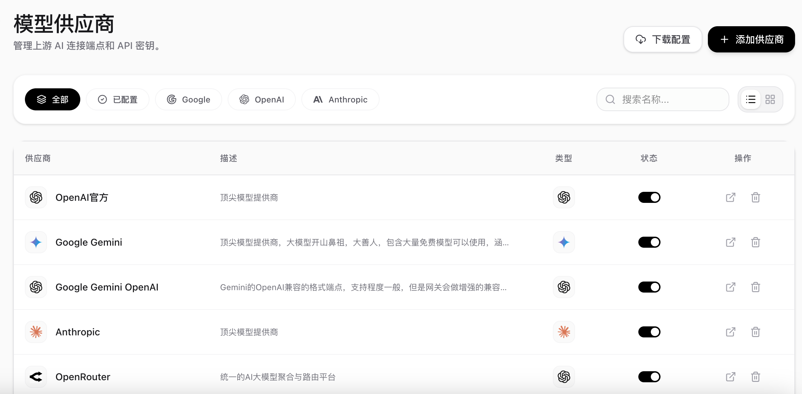
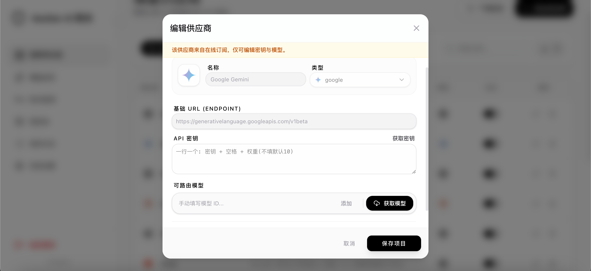
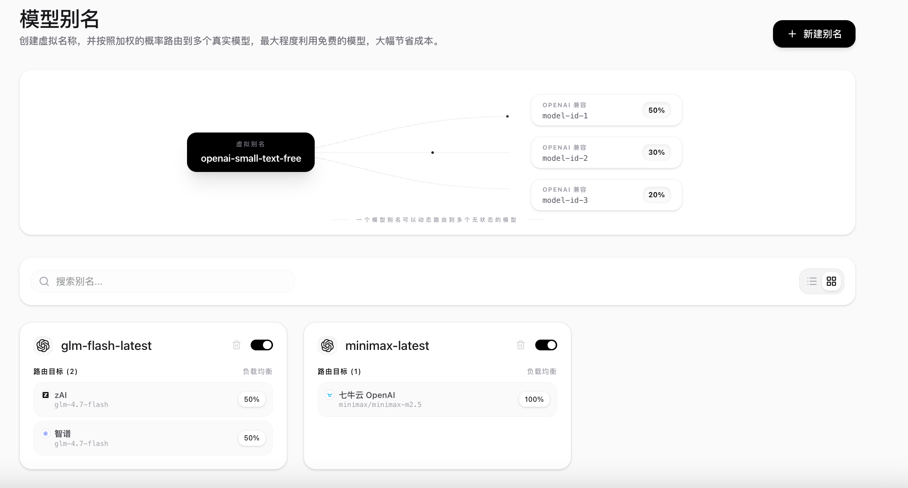
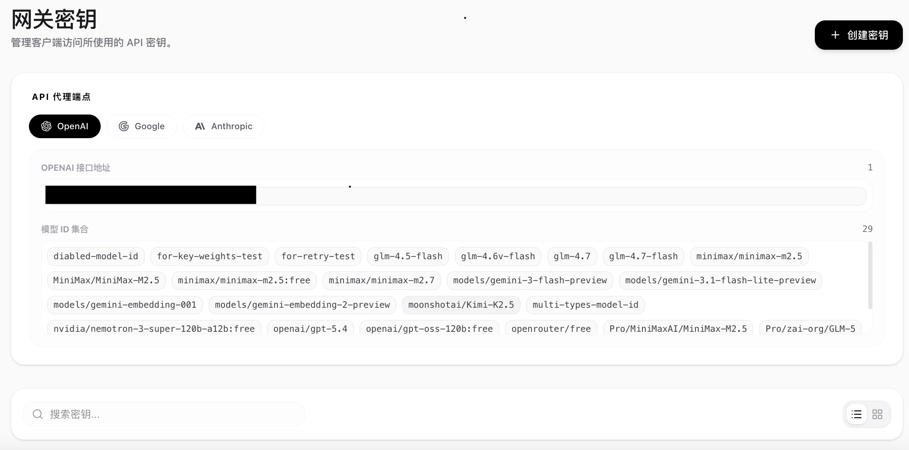
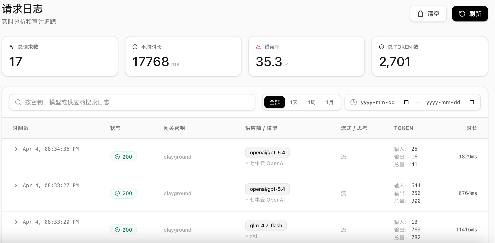
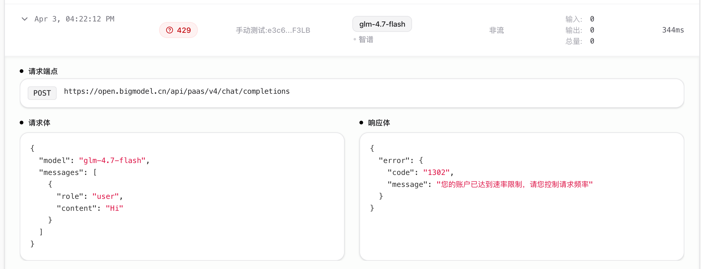
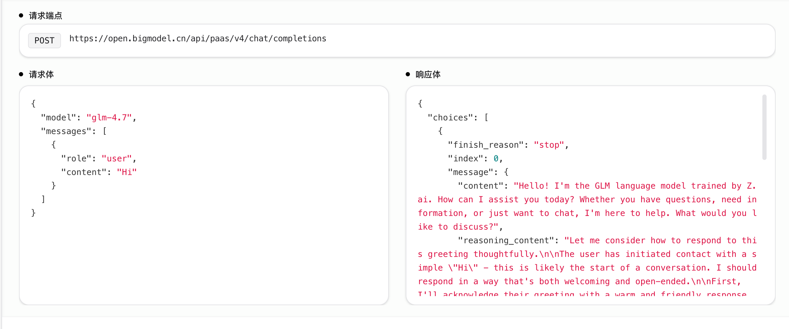
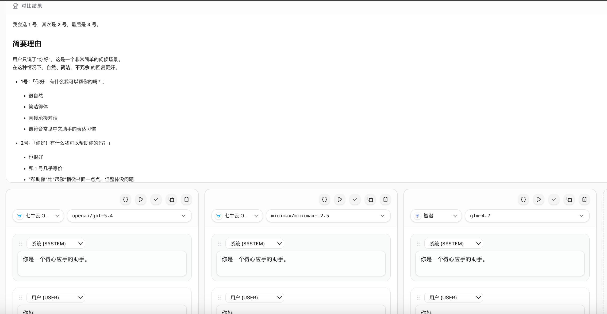

# Aeolian AI Gateway

Aeolian Gateway是一个轻量级的AI网关，可以让你部署在Cloudflare Workers边缘节点上运行，并提供统一的API接口，支持OpenAI、Google、Anthropic等多种模型。同时，它还提供了模型别名路由、Key层权重选择、自动切换Key重试、管理后台、请求日志等功能。

## 使用场景

### 场景一：您所在的地区 / 您的网络环境无法访问某个模型提供商

你可以把网关部署到提供边缘节点的服务，比如Cloudflare Workers，通过一些设置让网关在全球任何一个地方运行

### 场景二：同时使用很多个模型提供商，如何进行统一管理

注册了很多模型提供商，每个都要在软件中设置，烦不胜烦，有了网关你可以把全部提供商都加到一起，在软件设置中只填写网关地址，然后模型id可以填写模型提供商下的任何id，这些就方便管理，只需要添加一次即可

### 场景三：TOKEN不够用了，免费额度受限了

网关可以让你把这些额度/免费模型全部聚合起来，通过轮换密钥，模型智能路由充分利用服务商提供的免费额度，让你节省成本
 
### 场景四：日志分析

一大堆报错不知道什么原因？
token像流水一样到底花在哪里了？
...

网关可以把你在什么时候，发了什么，调用了什么工具，模型给你什么，消耗多少token花了多少钱等等全部记录日志，等你出错了可以查看日志就可以快速定位原因，
 
### 场景五：想让AI拥有记忆，越来越懂你(未实现)

网关可以记录你和模型的对话历史，可以很容易进行RAG

### 场景六：不希望隐私泄露

网关可以转发您的网络请求，且网关的地址是不断变化地， 不用担心提供商找到您的源地址

## 界面预览

以下是项目的部分界面截图展示：

点击展开查看截图

 

## 部署和使用教程

请参考 [部署文档](DEPLOYMENT.md) 进行项目的全量部署与初期配置。

## 开发教程

请参考 [开发文档](DEVELOPMENT.md) 获取本地环境搭建、测试运行及网关逻辑详情。

